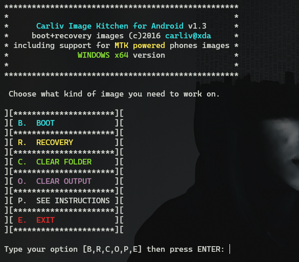
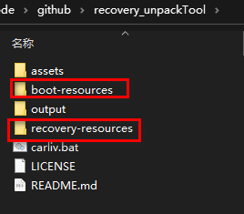
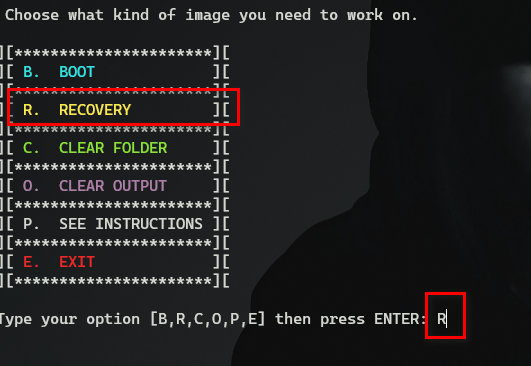
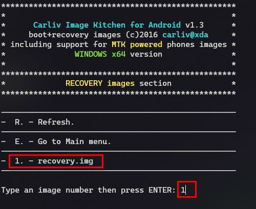
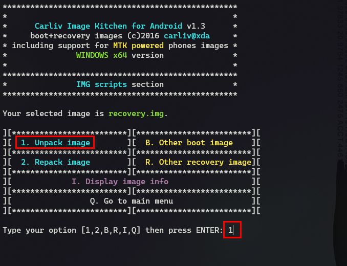
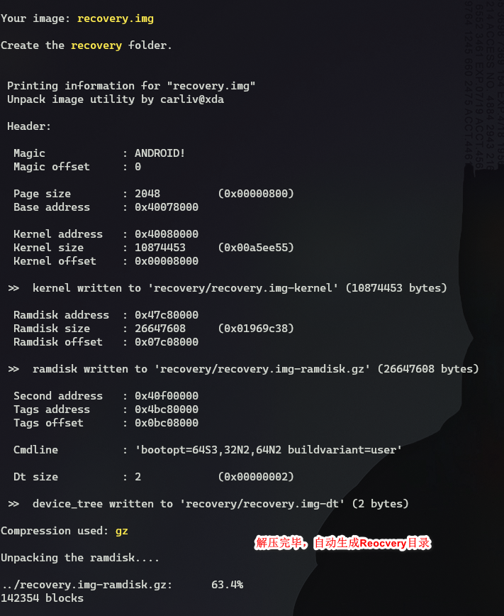
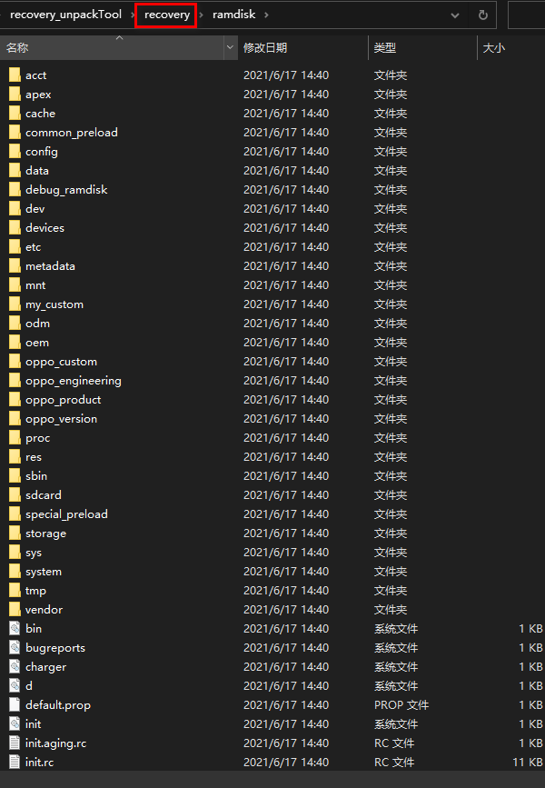

# recovery_unpackTool
recovery解压重打包工具
Windows系统下的一款Reocvery 和 boot分区解压重新打包工具，方便官改自定义的reocvery或root.

  

> 源自：https://forum.hovatek.com/thread-15816.html
## 流程

```bash
./carliv.bat #运行bat脚本
B / R        #选择要处理boot或recovery
拷贝boot.img或reocvery.img -> xxx-resource
B / R        #选择boot 或 recovery
1            #选着boot.img 或 recovery.img
1 / 2        #解压recovery/boot分区 或 重打包recovery/boot分区
```

## 解压reocvery.img例子

拷贝对应的boot.img 或reocvery.img到目录。

  

选择recovery选项

  

选择1 reocvery.img

  

选择1 解压reocvery.img镜像

  

执行完后的输出信息

  

解压出来的recovery分区
  

更多功能请参考： https://forum.hovatek.com/thread-15817.html
